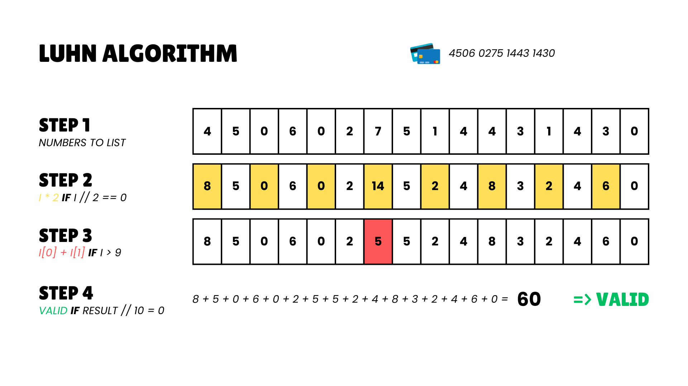

# Credit Card Number Generator

## 📌 Overview
This Python script generates valid credit card numbers based on a specified card type (**Visa, Mastercard, Amex, Discover**). It ensures that the generated numbers comply with the **Luhn Algorithm**, which is used for validating card numbers.



---

## 🚀 How It Works
1. **Choose a card type** (Visa, Mastercard, Amex, Discover).
2. **Generate a random card number** using predefined prefixes.
3. **Compute the checksum digit** with the Luhn Algorithm.
4. **Return a valid card number** that passes the Luhn check.

---

## 🛠️ Installation & Usage
### **Prerequisites**
- Python 3.x installed

### **Run the script**
```sh
python luhnAlgorithmCreate.py
```
```sh
python luhnAlgorithmCreateByCard.py
```
```sh
python luhnAlgorithmVerify.py 4506027514431430
```

